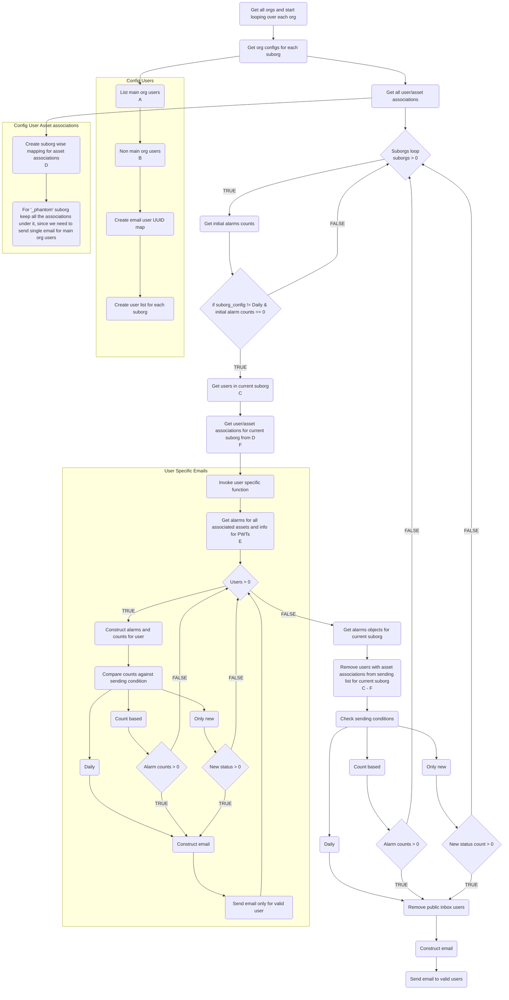

### Alarms Summary Emails - Flowchart

```mermaid
flowchart
    A(Get all orgs and start looping over each org) --> BBB(Get org configs for each suborg)
    BBB --> B(List main org users<br>A)
    subgraph Config Users
    B --> C(Non main org users<br>B)
    C --> D(Create email user UUID map)
    D --> E(Create user list for each suborg)
    end

    BBB --> F(Get all user/asset associations)

    F --> G(Create suborg wise mapping for asset associations<br>D)
    subgraph Config User Asset associations
    G --> H(For '_phantom' suborg keep all the associations under it, since we need to send single email for main org users)
    end

    F --> I{Suborgs loop<br>suborgs > 0}
    I --> |TRUE| II(Get initial alarms counts)
    II --> JJ{if suborg_config != Daily & initial alarm counts == 0}
    JJ --> |FALSE| I
    JJ --> |TRUE| J(Get users in current suborg<br>C)
    J --> K(Get user/asset associations for current suborg from D<br>F)

    K --> L(Invoke user specific function)
    subgraph User Specific Emails
    L --> M(Get alarms for all associated assets and info for PWTs<br>E)
    M --> N{Users > 0}
    N --> |TRUE| O(Construct alarms and counts for user)
    O --> P(Compare counts against sending condition)
    P --> AA(Daily) --> Q(Construct email)
    P --> BB(Count based) --> R{Alarm counts > 0}
    P --> CC(Only new) --> S{New status > 0}
    R --> |TRUE| Q
    R --> |FALSE| N
    S --> |TRUE| Q
    S --> |FALSE| N
    Q --> T(Send email only for valid user)
    T --> N
    end

    N --> |FALSE| U(Get alarms objects for current suborg)
    U --> V(Remove users with asset associations from sending list for current suborg<br>C - F)
    V --> W(Check sending conditions)
    W --> X(Daily)
    X --> Y(Remove public inbox users)
    W --> WW(Count based)
    WW --> AB{Alarm counts > 0}
    AB --> |TRUE| Y
    AB --> |FALSE| I
    W --> CD(Only new)
    CD --> AAA{New status count > 0}
    AAA --> |TRUE| Y
    AAA --> |FALSE| I
    Y --> CCC(Construct email)
    CCC --> DDD(Send email to valid users)

    
    
```