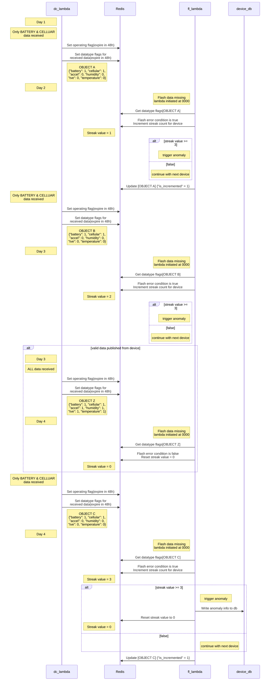

# Flash data missing anomaly - Sequence diagram

```mermaid

sequenceDiagram
    Note left of dc_lambda: Day 1
    %% Device ->> dc_lambda: Ingestion lambda
    Note left of dc_lambda: Only BATTERY & CELLUAR<br>data received
    dc_lambda ->> Redis: Set operating flag(expire in 48h)
    dc_lambda ->> Redis: Set datatype flags for<br>received data(expire in 48h)
    Note right of dc_lambda: OBJECT A<br>{"battery": 1, "cellular": 1,<br>"accel": 0, "humidity": 0,<br>"tve": 0, "temperature": 0}

    Note left of dc_lambda: Day 2
    Note left of fl_lambda: Flash data missing<br>lambda initiated at 0000
    fl_lambda ->> Redis: Get datatype flags[OBJECT A]
    fl_lambda ->> Redis: Flash error condition is true<br>Increment streak count for device
    Note left of Redis: Streak value = 1
    alt streak value >= 3
        Note left of fl_lambda: trigger anomaly
    else false
        Note left of fl_lambda: continue with next device
    end
    fl_lambda ->> Redis: Update [OBJECT A] {"is_incremented" = 1}
    
    Note left of dc_lambda: Only BATTERY & CELLUAR<br>data received
    dc_lambda ->> Redis: Set operating flag(expire in 48h)
    dc_lambda ->> Redis: Set datatype flags for<br>received data(expire in 48h)
    Note right of dc_lambda: OBJECT B<br>{"battery": 1, "cellular": 1,<br>"accel": 0, "humidity": 0,<br>"tve": 0, "temperature": 0}

    Note left of dc_lambda: Day 3
    Note left of fl_lambda: Flash data missing<br>lambda initiated at 0000
    fl_lambda ->> Redis: Get datatype flags[OBJECT B]
    fl_lambda ->> Redis: Flash error condition is true<br>Increment streak count for device
    Note left of Redis: Streak value = 2
    alt streak value >= 3
        Note left of fl_lambda: trigger anomaly
    else false
        Note left of fl_lambda: continue with next device
    end

    alt valid data published from device

        Note left of dc_lambda: Day 3
        Note left of dc_lambda: ALL data received

        dc_lambda ->> Redis: Set operating flag(expire in 48h)
        dc_lambda ->> Redis: Set datatype flags for<br>received data(expire in 48h)
        Note right of dc_lambda: OBJECT Z<br>{"battery": 1, "cellular": 1,<br>"accel": 1, "humidity": 1,<br>"tve": 1, "temperature": 1}


        Note left of dc_lambda: Day 4

        Note left of fl_lambda: Flash data missing<br>lambda initiated at 0000
        fl_lambda ->> Redis: Get datatype flags[OBJECT Z]
        fl_lambda ->> Redis: Flash error condition is false<br>Reset streak value = 0
        Note left of Redis: Streak value = 0
    end

    Note left of dc_lambda: Only BATTERY & CELLUAR<br>data received
    dc_lambda ->> Redis: Set operating flag(expire in 48h)
    dc_lambda ->> Redis: Set datatype flags for<br>received data(expire in 48h)
    Note right of dc_lambda: OBJECT C<br>{"battery": 1, "cellular": 1,<br>"accel": 0, "humidity": 0,<br>"tve": 0, "temperature": 0}


    Note left of dc_lambda: Day 4
    Note left of fl_lambda: Flash data missing<br>lambda initiated at 0000
    fl_lambda ->> Redis: Get datatype flags[OBJECT C]
    fl_lambda ->> Redis: Flash error condition is true<br>Increment streak count for device
    Note left of Redis: Streak value = 3
    alt streak value >= 3
        Note right of fl_lambda: trigger anomaly
        fl_lambda ->> device_db: Write anomaly info to db
        fl_lambda ->> Redis: Reset streak value to 0
        Note left of Redis: Streak value = 0
    else false
        Note right of fl_lambda: continue with next device
    end
    fl_lambda ->> Redis: Update [OBJECT C] {"is_incremented" = 1}


```
