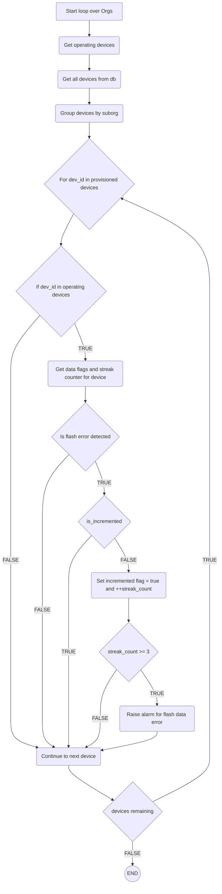

### Flash Data Error - Flowchart

```mermaid
flowchart TD
    A[Start loop over Orgs] --> B(Get operating devices)
    B --> C(Get all devices from db)
    C --> D(Group devices by suborg)
    D --> E{For dev_id in provisioned devices}
    E --> F{If dev_id in operating devices}
    F --> |FALSE| X
    X(Continue to next device) --> Z
    Z{devices remaining} --> |TRUE| E
    F --> |TRUE| G(Get data flags and streak counter for device)
    G --> H{Is flash error detected}
    H --> |FALSE| X
    H --> |TRUE| I{is_incremented}
    I --> |TRUE| X
    I --> |FALSE| J(Set incremented flag = true and ++streak_count)
    J --> K{streak_count >= 3}
    K --> |FALSE| X
    K --> |TRUE| L(Raise alarm for flash data error)
    L --> X
    Z --> |FALSE| Y((END))
    
```
