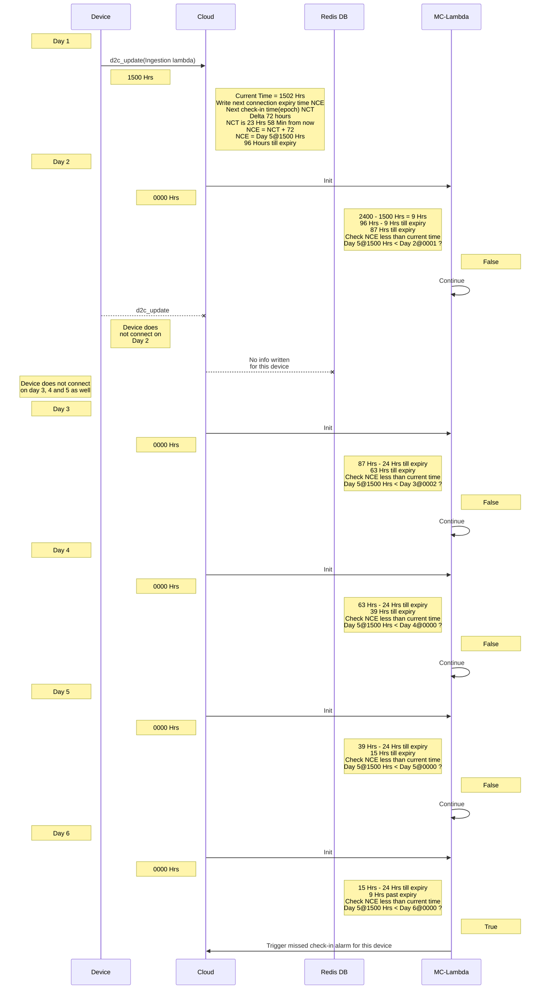

### Event Sequence - Everyday

This config is for everyday @ 1500 Hours
```
cloud_update_config = "0 15 * * *"
```



```mermaid
sequenceDiagram
    Note left of Device: Day 1
    Device ->> Cloud: d2c_update(Ingestion lambda)
    Note right of Device: 1500 Hrs
    Note left of Redis DB: Current Time = 1502 Hrs<br/>Write next connection expiry time NCE<br/>Next check-in time(epoch) NCT<br/>Delta 72 hours<br/>NCT is 23 Hrs 58 Min from now<br/>NCE = NCT + 72<br/>NCE = Day 5@1500 Hrs<br/>96 Hours till expiry


    Note left of Device: Day 2
    Cloud ->> MC-Lambda: Init
    Note left of Cloud: 0000 Hrs
    Note left of MC-Lambda: 2400 - 1500 Hrs = 9 Hrs<br/>96 Hrs - 9 Hrs till expiry<br/>87 Hrs till expiry<br/>Check NCE less than current time<br>Day 5@1500 Hrs < Day 2@0001 ?
    Note right of MC-Lambda: False
    MC-Lambda ->> MC-Lambda: Continue
    Device --x Cloud: d2c_update
    Note right of Device: Device does<br>not connect on<br>Day 2
    Cloud--xRedis DB: No info written<br>for this device


    Note left of Device: Device does not connect <br>on day 3, 4 and 5 as well
    Note left of Device: Day 3
    Cloud ->> MC-Lambda: Init
    Note left of Cloud: 0000 Hrs
    Note left of MC-Lambda: 87 Hrs - 24 Hrs till expiry<br/>63 Hrs till expiry<br/>Check NCE less than current time<br>Day 5@1500 Hrs < Day 3@0002 ?
    Note right of MC-Lambda: False
    MC-Lambda ->> MC-Lambda: Continue


    Note left of Device: Day 4
    Cloud ->> MC-Lambda: Init
    Note left of Cloud: 0000 Hrs
    Note left of MC-Lambda: 63 Hrs - 24 Hrs till expiry<br/>39 Hrs till expiry<br/>Check NCE less than current time<br>Day 5@1500 Hrs < Day 4@0000 ?
    Note right of MC-Lambda: False
    MC-Lambda ->> MC-Lambda: Continue

    Note left of Device: Day 5
    Cloud ->> MC-Lambda: Init
    Note left of Cloud: 0000 Hrs
    Note left of MC-Lambda: 39 Hrs - 24 Hrs till expiry<br/>15 Hrs till expiry<br/>Check NCE less than current time<br>Day 5@1500 Hrs < Day 5@0000 ?
    Note right of MC-Lambda: False
    MC-Lambda ->> MC-Lambda: Continue

    Note left of Device: Day 6
    Cloud ->> MC-Lambda: Init
    Note left of Cloud: 0000 Hrs
    Note left of MC-Lambda: 15 Hrs - 24 Hrs till expiry<br/>9 Hrs past expiry<br/>Check NCE less than current time<br>Day 5@1500 Hrs < Day 6@0000 ?
    Note right of MC-Lambda: True

    MC-Lambda ->> Cloud: Trigger missed check-in alarm for this device

```

